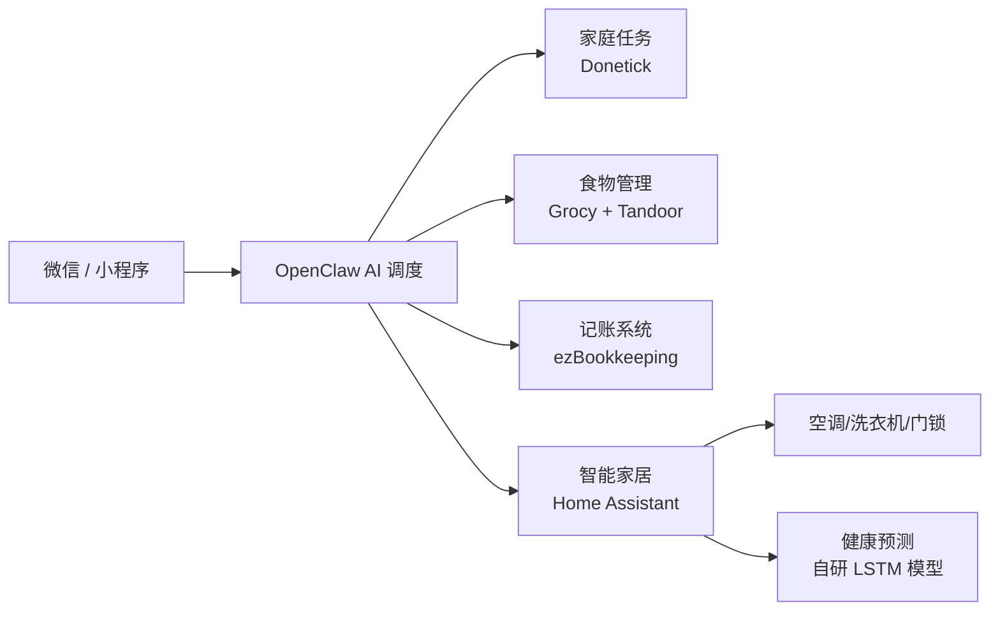

# ForMyLazyWife
🏠 一个跑在 NAS 上的家庭AI管家：微信一句话指挥家务、管理冰箱库存、自动记账，还偷偷记住了她的生理期。全本地部署，数据主权归家。

# 🏠 ForMyLazyWife / 家务OS

> *"老婆能躺着绝不坐着，能动嘴绝不动手。于是我用一台 NAS，给她搭了个隐形的家庭管家。"*

## 📖 项目起源

老婆有一天刷手机，说想要一个能听懂人话的管家，对着微信说句话就能安排家务、管冰箱、记账单。  
我整理完她的需求后，发现这不止是做个机器人，而是要把整个家“数字化”一遍。  
于是，这个项目诞生了——**代码是冷的，但日子是热的。**

## 🎯 它能做什么？

- 💬 **微信一句话指挥**：通过 OpenClaw 机器人，在微信里用自然语言安排任务、查询库存、记账。
- 📱 **小程序可视化**：家人用微信小程序查看冰箱存货、家庭账本、任务进度。
- 🗓️ **家庭任务系统**：基于 Donetick，自动编排家务，完成情况实时通知。
- 🥦 **食物状态管理**：基于 Grocy，记录食材采购/过期时间，临期自动提醒，还能根据库存推荐菜谱。
- 💰 **家用记账**：基于 ezBookkeeping，支持手动/微信触发记账，分类统计一目了然。
- 🌡️ **智能家居中枢**：Home Assistant 统一接入格力空调、美的洗衣机等设备。
- ❤️ **健康关怀（隐藏功能）**：接入 Apple Watch 数据，AI 预测生理期，提前提醒煮五红汤、苹果黄芪水。

## 🧱 技术架构

