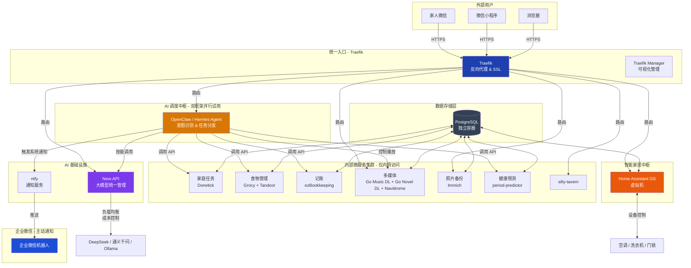

## 🧱 系统架构设计图

# Ai Jia S 系统架构图

> 双 Agent 并行试用期架构，最终将二选一作为长期 AI 管家。

```mermaid
flowchart TB
    subgraph External[外部用户]
        direction LR
        User1[家人微信]
        User2[微信小程序]
        User3[浏览器]
    end

    subgraph Gateway[统一入口 - Traefik]
        Traefik[Traefik<br>反向代理 & SSL]
        Manager[Traefik Manager<br>可视化管理]
    end

    subgraph AI_Orchestrator[AI 调度中枢 - 双框架并行试用]
        Agent[OpenClaw / Hermes Agent<br>意图识别 & 任务分发]
    end

    subgraph AI_Infra[AI 基础设施]
        NewAPI[New-API<br>大模型统一管理]
        ntfy[ntfy<br>通知服务]
    end

    subgraph WeCom[企业微信 - 主动通知]
        WeComBot[企业微信机器人]
    end

    subgraph Internal[内部微服务集群 - 仅内网访问]
        direction LR
        Tasks[家庭任务<br>Donetick]
        Food[食物管理<br>Grocy + Tandoor]
        Books[记账<br>ezBookkeeping]
        Media[多媒体<br>Go Music DL + Go Novel DL + Navidrome]
        Photos[照片备份<br>Immich]
        Health[健康预测<br>period-predictor]
        Chat[silly-tavern]
    end

    subgraph Database[数据存储层]
        DB[(PostgreSQL<br>独立容器)]
    end

    subgraph SmartHome[智能家居中枢]
        HA[Home Assistant OS<br>虚拟机]
    end

    User1 & User2 & User3 -->|HTTPS| Traefik
    Traefik -->|路由| NewAPI
    Traefik -->|路由| Agent
    Traefik -->|路由| HA
    Traefik -->|路由| Media
    Traefik -->|路由| Photos
    Traefik -->|路由| Chat

    Agent -->|技能调用| NewAPI
    NewAPI -->|负载均衡<br>成本控制| External_Models[DeepSeek / 通义千问 / Ollama]
    Agent -->|调用 API| Tasks
    Agent -->|调用 API| Food
    Agent -->|调用 API| Books
    Agent -->|调用 API| Health
    Agent -->|控制播放| Media

    Agent -->|触发系统通知| ntfy
    ntfy -->|推送| WeComBot

    HA <-->|设备控制| Devices[空调 / 洗衣机 / 门锁]
    DB <--> Tasks & Food & Books & Health & Media & Photos
    DB <--> HA

    style Traefik fill:#1e40af,color:#fff
    style NewAPI fill:#7c3aed,color:#fff
    style Agent fill:#d97706,color:#fff
    style HA fill:#ea580c,color:#fff
    style DB fill:#334155,color:#fff
    style WeComBot fill:#1d4ed8,color:#fff

```
